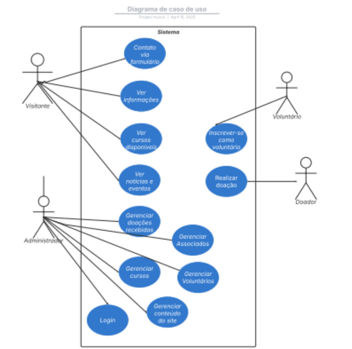

# Especificação do projeto

Pré-requisitos: <a href="01-Contexto.md"> Documentação de contexto</a>

Definição do problema e ideia de solução a partir da perspectiva do usuário. É composta pela definição do  diagrama de personas, histórias de usuários, requisitos funcionais e não funcionais além das restrições do projeto.

Apresente uma visão geral do que será abordado nesta parte do documento, enumerando as técnicas e/ou ferramentas utilizadas para realizar a especificações do projeto.

## Personas

1. João Batista – Visitante Público
João tem 45 anos, é pedreiro, mora em Contagem e ouviu falar da Mucuri por meio de um vizinho. Ele gostaria de saber mais sobre os cursos oferecidos pela instituição para recomendar à filha adolescente. João usa o celular para acessar redes sociais e notícias, mas não tem familiaridade com navegação em sites complexos.
2. Ana Clara – Voluntária Potencial
Ana tem 22 anos, é estudante de Psicologia e quer dedicar parte do seu tempo a causas sociais. Acredita na transformação por meio da educação e está à procura de oportunidades para atuar como voluntária. É ativa nas redes sociais e tem bom domínio de tecnologia.
3. Marcos Vinícius – Doador
Marcos tem 38 anos, é gerente de marketing em uma empresa de médio porte e busca projetos sociais confiáveis para apoiar. Quer fazer doações com segurança, acompanhar resultados e entender melhor o impacto gerado. Acessa frequentemente sites institucionais e é exigente com transparência.
4. Luciana Rocha – Administradora da Instituição
Luciana tem 40 anos, é coordenadora administrativa da Mucuri há 6 anos. Ela organiza os cursos, eventos e inscrições de voluntários. Sente dificuldade em atualizar o banco de dados e depende de planilhas e documentos impressos. Tem conhecimento básico em informática.
5. Rafael Moura – Gestor Técnico
Rafael é voluntário e também atua como consultor de TI. Ele oferece suporte técnico à Mucuri e está ajudando na transição para a nova plataforma. Tem profundo conhecimento em infraestrutura, banco de dados e segurança da informação.

## Histórias de usuários

Com base na análise das personas, foram identificadas as seguintes histórias de usuários:

|EU COMO... `PERSONA`| QUERO/PRECISO ... `FUNCIONALIDADE` |PARA ... `MOTIVO/VALOR`                 |
|--------------------|------------------------------------|----------------------------------------|
|Visitante           | Ver informações sobre a instituição|Conhecer melhor a Mucuri e seus projetos|
|Visitante           | Acessar cursos e eventos           |Acompanhar oportunidades de capacitação |
|Voluntário          |Preencher formulário de inscrição   |Me candidatar às vagas de voluntariado  |
|Voluntário          |Acompanhar informações e notícias   |Me manter atualizado sobre a instituição|
|Doador              |Ver opções de doação                |Contribuir com a causa da Mucuri        |
|Doador              |Ter confiança nas infos do site     |Saber que a doação está sendo utilizada |
|Administrador       |Gerenciar associados                |Manter a base de dados organizada       |
|Administrador       | Acessar painel restrito            |Realizar tarefas administrativas seguras|
|Gestor Técnico      | Manter o sistema atualizado        |Garantir segurança e desempenho         |
|Gestor Técnico      |Ter acesso à base de dados          |Corrigir erros e gerir a infraestrutura |

## Requisitos

As tabelas a seguir apresentam os requisitos funcionais e não funcionais que detalham o escopo do projeto.

### Requisitos funcionais

|ID    | Descrição do Requisito  | Prioridade |
|------|-----------------------------------------|----|
|RF-001| Exibir informações da instituição | ALTA | 
|RF-002| Apresentar informações detalhadas sobre cursos e eventos   | ALTA |
|RF-003| Exibir instruções e disponibilizar formulário para doação   | ALTA |
|RF-004| Disponibilizar formulário para voluntários   | ALTA |
|RF-005| Administrar associados da instituição   | ALTA |
|RF-006| Exibir informaçoes de contato e redes sociais   | ALTA |
|RF-007| Apresentar informações detalhadas sobre cursos e eventos   | ALTA |
|RF-008| Permitir que adminsitradores gerenciem conteúdos e cadastros   | ALTA |
|RF-009| Integração com redes sociais   | MÉDIA |

### Requisitos não funcionais

|ID     | Descrição do Requisito  |Prioridade |
|-------|-------------------------|----|
|RNF-001| O sistema deve possuir uma interface simples e intuitiva | ALTA | 
|RNF-002| A aplicação deve ser compatível com navegadores e dispositivos móveis |  ALTA | 
|RNF-003| A plataforma deve utilizar uma atenticação segura |  ALTA | 
|RNF-004| O sistema deve responder às ações do usuário em até 2 segundos |  MÉDIA | 
|RNF-005| O site e a plataforma devem estar disponíveis 99% do tempo |  MÉDIA | 
|RNF-006| O site deve estar em conformidade com WCAG |  BAIXA | 
|RNF-007| O código deve ser desenvolvido de forma modular |  MÉDIA | 
|RNF-008| A arquitetura deve permitir adição de módulos sem grandes reestruturações |  BAIXA | 

## Restrições

Enumere as restrições à sua solução. Lembre-se de que as restrições geralmente limitam a solução candidata.

O projeto está restrito aos itens apresentados na tabela a seguir.

|ID| Restrição                                             |
|--|-------------------------------------------------------|
|001| O projeto deverá ser entregue até o final do semestre |
|002| O custo total do projeto não deve exceder o orçamento definido       |

## Diagrama de casos de uso

