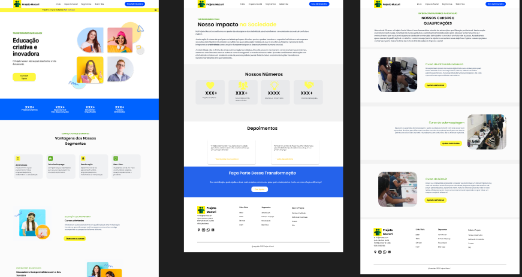
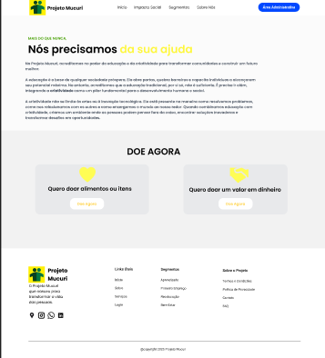
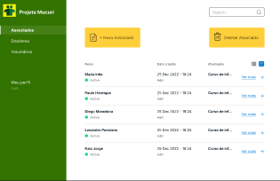

# Projeto de Interface

> 📎 Pré-requisitos: [Especificação do projeto](02-Especificacao.md)

Este módulo apresenta a visão geral da **interação do usuário com o sistema**, por meio do fluxo de navegação, wireframes e protótipos desenvolvidos com foco na **usabilidade, acessibilidade e clareza da informação**.

As interfaces foram desenhadas com base nos requisitos funcionais e não funcionais definidos, considerando também os perfis dos usuários descritos nas histórias de usuário.

---

## 🧭 User Flow

O **fluxo de usuário** (user flow) representa o caminho percorrido pelos diferentes perfis ao interagir com o sistema. Ele permite prever e alinhar as ações possíveis dentro da aplicação.

> O user flow foi definido com base nas rotas principais: acesso público ao site, visualização de informações institucionais, formulário de voluntariado, área de doações e painel administrativo para usuários autenticados.

---

## 📐 Wireframes

Os **wireframes** foram utilizados para mapear a estrutura das páginas da aplicação. Os protótipos foram desenvolvidos no Figma, com foco em responsividade, clareza visual e acessibilidade (WCAG 2.1).

A estrutura foi pensada para atender usuários com diferentes níveis de familiaridade digital, garantindo navegação fluida tanto em dispositivos móveis quanto em desktop.

- Protótipos disponíveis no Figma:  
[🔗 Acessar Protótipo Interativo](https://www.figma.com/design/HGYbs8drjvyoYrVpfO0soK/Projeto-Mucuri-Template)

---

## 💻 Interface do Sistema

As interfaces finais foram construídas com base nos wireframes, respeitando os requisitos e refletindo os fluxos definidos.

### 🏠 Tela Principal

A tela inicial apresenta um resumo da instituição, chamada para doações e botões de acesso aos menus “Cursos”, “Voluntariado” e “Fale Conosco”.

> 

---

### 💰 Telas do Processo 2 – Registro de Doações

#### 💸 Página de Doações

Tela com instruções para doações e botão de formulário de contato.

> 

#### 📥 Formulário de Contato para Doação

Usuário pode inserir nome, valor ou tipo de doação, e mensagem.

> 

### 💰 Telas do administrador – 

#### 💸 Página do administrador

Tela com cadastros.

> 

