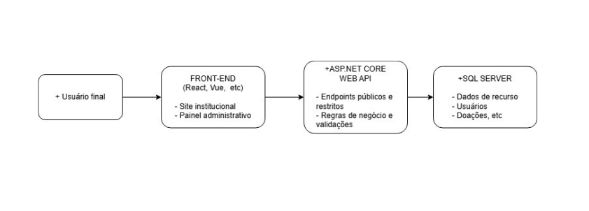
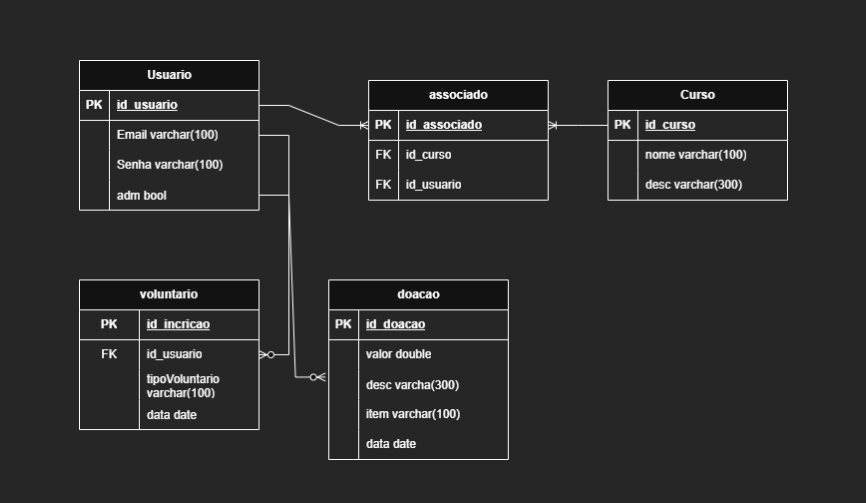
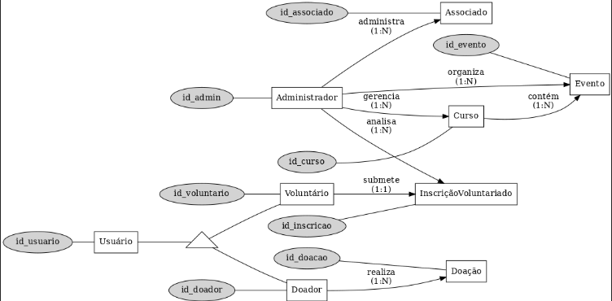

# Arquitetura da solução

<span style="color:red">Pré-requisitos: <a href="05-Projeto-interface.md"> Projeto de interface</a></span>

Definição de como o software é estruturado em termos dos componentes que fazem parte da solução e do ambiente de hospedagem da aplicação.



## Diagrama de classes

O diagrama de classes ilustra graficamente a estrutura do software e como cada uma das classes estará interligada. Essas classes servem de modelo para materializar os objetos que serão executados na memória.



##  Modelo de dados

O desenvolvimento da solução proposta requer a existência de bases de dados que permitam realizar o cadastro de dados e os controles associados aos processos identificados, assim como suas recuperações.

Utilizando a notação do DER (Diagrama Entidade-Relacionamento), elabore um modelo, usando alguma ferramenta, que contemple todas as entidades e atributos associados às atividades dos processos identificados. Deve ser gerado um único DER que suporte todos os processos escolhidos, visando, assim, uma base de dados integrada. O modelo deve contemplar também o controle de acesso dos usuários (partes interessadas nos processos) de acordo com os papéis definidos nos modelos do processo de negócio.

Apresente o modelo de dados por meio de um modelo relacional que contemple todos os conceitos e atributos apresentados na modelagem dos processos.

### Modelo ER



### Esquema relacional

O Esquema Relacional corresponde à representação dos dados em tabelas juntamente com as restrições de integridade e chave primária.
 


---

> **Links úteis**:
> - [Criando um modelo relacional - documentação da IBM](https://www.ibm.com/docs/pt-br/cognos-analytics/12.0.0?topic=designer-creating-relational-model)

### Modelo físico

Insira aqui o script de criação das tabelas do banco de dados.

Veja um exemplo:

```sql
-- Criação da tabela Medico
CREATE TABLE Medico (
    MedCodigo INTEGER PRIMARY KEY,
    MedNome VARCHAR(100)
);

-- Criação da tabela Paciente
CREATE TABLE Paciente (
    PacCodigo INTEGER PRIMARY KEY,
    PacNome VARCHAR(100)
);

-- Criação da tabela Consulta
CREATE TABLE Consulta (
    ConCodigo INTEGER PRIMARY KEY,
    MedCodigo INTEGER,
    PacCodigo INTEGER,
    Data DATE,
    FOREIGN KEY (MedCodigo) REFERENCES Medico(MedCodigo),
    FOREIGN KEY (PacCodigo) REFERENCES Paciente(PacCodigo)
);

-- Criação da tabela Medicamento
CREATE TABLE Medicamento (
    MdcCodigo INTEGER PRIMARY KEY,
    MdcNome VARCHAR(100)
);

-- Criação da tabela Prescricao
CREATE TABLE Prescricao (
    ConCodigo INTEGER,
    MdcCodigo INTEGER,
    Posologia VARCHAR(200),
    PRIMARY KEY (ConCodigo, MdcCodigo),
    FOREIGN KEY (ConCodigo) REFERENCES Consulta(ConCodigo),
    FOREIGN KEY (MdcCodigo) REFERENCES Medicamento(MdcCodigo)
);
```
Esse script deverá ser incluído em um arquivo .sql na pasta [de scripts SQL](../src/db).


## Tecnologias


| **Dimensão**   | **Tecnologia**  |
| ---            | ---             |
| Front-end      | React.js |
| Back-end       | ASP.NET Core Web API (C#)         |
| SGBD           | SQL SERVER           |
| Deploy Front        | Vercel          |
| SGBD Back          | Microsoft Azure           |
| Controle da versão           | Github          |


## Hospedagem

### Back-end
Hospedado na plataforma Microsoft Azure

### Front-end
Publicado utilizando Vercel

## ✅ Qualidade de Software

A qualidade do software especifica características e subcaracterísticas que devem ser observadas no desenvolvimento de sistemas com foco na satisfação do usuário e na confiabilidade do produto.

### 🎯 Subcaracterísticas Adotadas

| Característica     | Subcaracterística        | Justificativa |
|--------------------|--------------------------|----------------|
| **Usabilidade**    | Apreensibilidade         | Interface intuitiva para facilitar o aprendizado dos usuários da instituição Mucuri. |
| **Confiabilidade** | Maturidade               | Redução de falhas por meio de testes internos rigorosos antes da implantação. |
| **Eficiência de Desempenho** | Tempo de Resposta | Monitoramento ativo do tempo de resposta durante a fase inicial de produção. |
| **Manutenibilidade** | Modularidade           | Arquitetura modular facilita a manutenção, correção de bugs e evolução da aplicação. |

### 📏 Métricas para Avaliação da Qualidade

- ⏱️ **Tempo médio de resposta** por requisição.
- ❌ **Taxa de erros/falhas** reportadas semanalmente.
- 🛠️ **Tempo médio de resolução** de bugs.
- 📊 **Índice de satisfação** dos usuários após o treinamento (via formulário de feedback).
